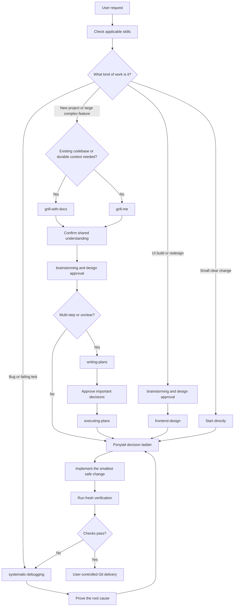
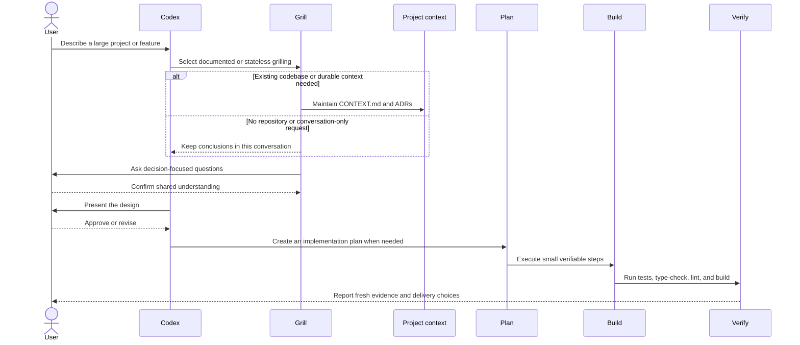
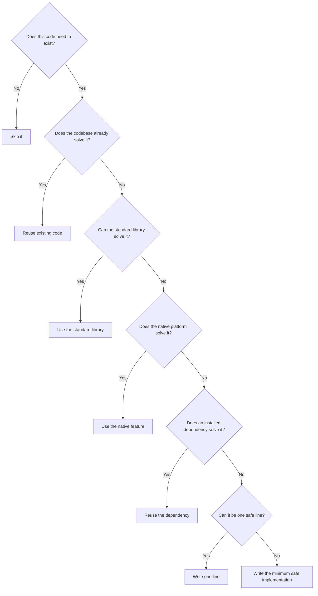
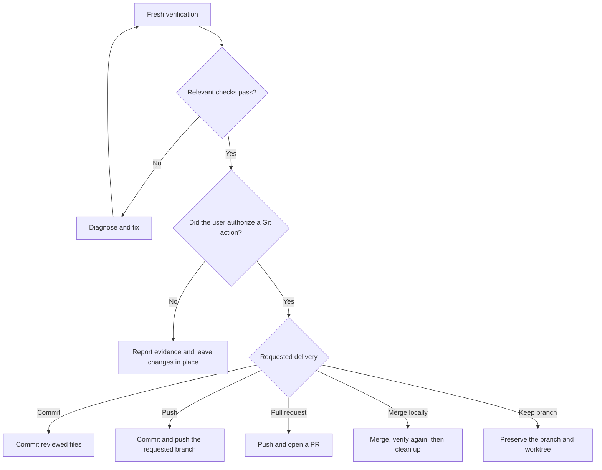

# Codex Powers

A portable Codex workflow for turning an idea into verified, user-approved software without unnecessary code or process.

It combines:

- **Superpowers** for skill selection, brainstorming, planning, debugging, execution, and verification.
- **Grill** for stress-testing large ideas before implementation.
- **Ponytail** for choosing the smallest safe solution.
- Specialist skills for UI, accessibility, SwiftUI, React, documents, spreadsheets, and other focused work.

## What is in this repository?

- [`AGENTS.md`](AGENTS.md) — the project-level working agreement Codex follows.
- [`docs/WORKFLOW.md`](docs/WORKFLOW.md) — copy-ready prompts for common tasks.
- [`docs/plans/`](docs/plans/) — implementation plans and their completion state.

## Complete workflow

Every request starts with understanding the work, then follows the shortest workflow that safely handles it.



### 1. Start with Superpowers

`using-superpowers` checks whether a specialized skill should guide the request. The selected process depends on the work instead of forcing every task through the same ceremony.

| Request | Workflow |
| --- | --- |
| New project or large context-heavy feature | Grill first, then brainstorm and plan |
| Multi-file or unclear change | `writing-plans` → approval → `executing-plans` |
| Bug, test failure, or unexpected behavior | `systematic-debugging` → root cause → smallest fix |
| UI build or material redesign | `brainstorming` → approval → `frontend-design` |
| UI, UX, or accessibility review | `web-design-guidelines` |
| Small, clearly specified change | Implement directly with Ponytail guidance |
| Completion claim | `verification-before-completion` |
| Branch integration | `finishing-a-development-branch` |

### 2. Grill only when the work deserves it

Grilling is an intake gate for new projects and large, complicated features—not routine work.

- **`grill-with-docs`** is for an existing codebase or work that future LLM sessions must understand. It combines `grilling` with `domain-modeling`, maintaining `CONTEXT.md` and important architecture decision records when warranted.
- **`grill-me`** is for a new idea with no repository, or an explicitly conversation-only stress test. It invokes `grilling` but writes no project files.
- Bugs, maintenance, mechanical edits, and small clear features skip grilling unless the user asks for it.

“Stateless” does not mean the current conversation has no context. It means bare `grill-me` creates no durable project record for a future task to read.



### 3. Apply Ponytail before writing code

Ponytail keeps implementation deliberately boring. Stop at the first option that safely solves the real problem.



Ponytail never removes required validation, security, accessibility, data-loss protection, error handling, or tests.

### 4. Plan and implement proportionally

- Use a written plan for multi-file work or unclear requirements.
- Review product, architecture, and hard-to-reverse decisions before implementation.
- Execute the approved plan in small independently verifiable steps.
- Use an isolated worktree only when the user authorizes it.
- Do not create speculative abstractions, dependencies, or scaffolding.

### 5. Verify before saying “done”

Completion requires fresh evidence appropriate to the change:

- Tests for behavior.
- Type-checking for type safety.
- Linting for static issues.
- A build for compilation and packaging.
- Focused reproduction checks for fixed bugs.
- Visual and accessibility checks for UI changes.

Passing one check does not imply the others passed. Codex reports the commands actually run and any remaining gaps.

### 6. Keep Git delivery under user control

Codex does not initialize repositories, create worktrees, commit, push, merge, or open pull requests without authorization.



## Quick start

1. Copy [`AGENTS.md`](AGENTS.md) into the root of your project.
2. Optionally copy [`docs/WORKFLOW.md`](docs/WORKFLOW.md) into its `docs/` directory.
3. Install the Superpowers and Ponytail plugins in Codex.
4. Install these four folders from [`mattpocock/skills`](https://github.com/mattpocock/skills) using Codex's built-in `skill-installer`:
   - `skills/productivity/grill-me`
   - `skills/productivity/grilling`
   - `skills/engineering/grill-with-docs`
   - `skills/engineering/domain-modeling`
5. Open the project in Codex and describe the outcome you want.

You can ask Codex to install the Grill skills with:

> Use skill-installer to install grill-me, grilling, grill-with-docs, and domain-modeling from mattpocock/skills.

## Ponytail installation

```sh
codex plugin marketplace add DietrichGebert/ponytail
codex plugin add ponytail@ponytail
```

Open `/hooks` in Codex, review and trust Ponytail's lifecycle hooks, then restart the app. The fallback Ponytail rules in [`AGENTS.md`](AGENTS.md) still apply if the hooks are unavailable.

## Example requests

Large feature:

> Use grill-with-docs to clarify this feature and preserve the domain context. Once we confirm shared understanding, brainstorm the design and wait for approval before planning implementation.

Conversation-only idea:

> Use grill-me to stress-test this idea. Keep it stateless and do not create project files.

Bug:

> Use systematic-debugging. Reproduce the problem, prove the root cause, then implement and verify the smallest root-cause fix.

Small feature:

> Implement this directly using Ponytail's decision ladder. Reuse existing code and run the smallest relevant verification.

See [`docs/WORKFLOW.md`](docs/WORKFLOW.md) for more copy-ready prompts.

## Use in another project

```sh
cp /path/to/codex-powers/AGENTS.md /path/to/your-project/AGENTS.md
mkdir -p /path/to/your-project/docs
cp /path/to/codex-powers/docs/WORKFLOW.md /path/to/your-project/docs/WORKFLOW.md
```

Adapt the UI, Git, and verification rules to the project's stack. Keep user control over commits, pushes, pull requests, and destructive actions.

## Contributing

Keep the workflow short, concrete, and tool-agnostic where possible. Prefer existing capabilities and the native platform before adding dependencies.

## License

[MIT](LICENSE)
