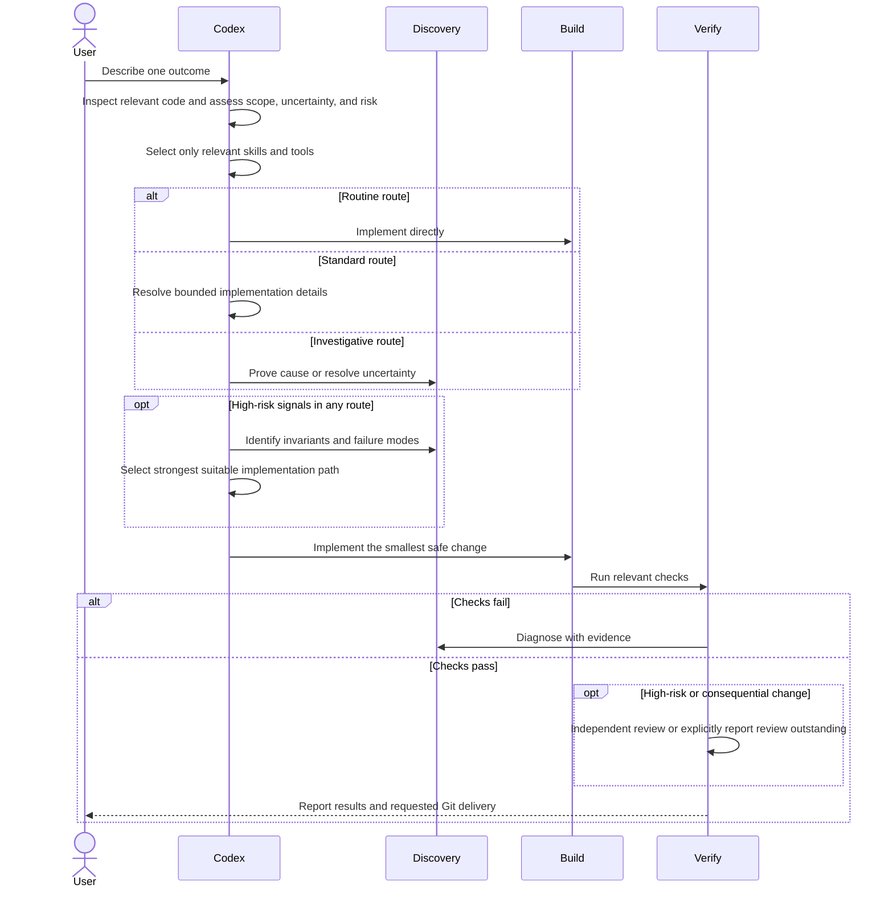

# Codex Powers

A small, portable workflow for building verified software with Codex while keeping session context focused.

It combines:

- **Superpowers** for choosing the right development workflow.
- **Grill** for clarifying large or ambiguous work.
- **Ponytail** for selecting the smallest safe implementation.
- **Fresh verification** before completion or Git delivery.
- **Optional Headroom trial** for reducing large tool outputs before they enter model context.

Select only what the task needs. Route work using observable risk signals, keep routine work direct, and add investigation or independent review only when the affected behavior warrants it.

## Workflow

## Core rules

- **One outcome per task.** Compact at a safe boundary when a milestone is complete, low-value output dominates the context, or remaining headroom is becoming low. Keep a concise checkpoint when needed and continue the same outcome after compaction.
- **Finish the requested outcome.** Continue through implementation and relevant verification; stop at discovery or review only when requested.
- **Infer acceptance criteria.** Identify the requested outcome, constraints, permitted side effects, and proof of success; ask only about ambiguities that could materially change the result.
- **Use the lightest workflow that fits.** Routine changes stay direct. Investigation begins only for a concrete unknown or failure, and independent review is reserved for consequential risk. Small changes can still be high-risk.
- **Resolve the nearest unknown first.** Resolve consequential decisions before dependent work; create no plan files unless requested.
- **Sequence without ceremony.** Internally decompose dependent work whenever correctness requires it; a plan artifact is optional and user-requested.
- **Prefer references over pasted context.** Point Codex to an existing file, example, or URL when possible.
- **Implement minimally.** Reuse project code, the standard library, native features, or installed dependencies before adding code.
- **Verify in proportion to risk.** Test behavior changes meaningfully; use parse, diff, link, or configuration checks for docs and config. Broaden suites only when integration or unresolved risk warrants it.
- **Keep Git user-controlled.** Codex commits, pushes, merges, or opens a PR only when explicitly requested.
- **Name branches by intent.** Use `<type>/<short-description>` with `fix`, `feat`, `ui`, `docs`, `refactor`, `test`, or `chore` based on the requested work.

## Request routing

Estimate scope from the prompt, then inspect the relevant code before choosing a route. Reassess when evidence changes the estimate. The diagram shows work stages, not separate agents.

| Route | Observable signals | Execution |
| --- | --- | --- |
| **Routine** | Clear, localized, reversible, one subsystem, reliable checks, no sensitive domain | Direct implementation → focused verification |
| **Standard** | Moderate repository reasoning or related multi-file change without high-risk signals | Capable lead implements end to end → affected checks |
| **Investigative** | Bug, failure, unfamiliar path, dependency ambiguity, weak tests, or failed attempt | Prove cause or resolve uncertainty → smallest change → regression evidence |
| **High-risk** | Auth, security, secrets, privacy, payments, destructive behavior, migrations, concurrency, public APIs, irreversible state, or cross-system blast radius | Strongest suitable implementation → deterministic checks → independent review; human approval for irreversible production actions |

Routes can overlap: investigation resolves uncertainty, while risk determines the required assurance. An authentication bug needs root-cause investigation plus the high-risk implementation, verification, and review requirements. Resolving the cause does not remove those requirements; delegation remains opt-in. If independent review cannot proceed, finish authorized implementation and checks, report review as outstanding, and request delegation or human review. Self-review does not satisfy this requirement.

New projects and large ambiguous features first resolve consequential decisions. UI work still uses the relevant design or accessibility skill. Completion always requires fresh, proportional verification and only user-authorized Git delivery.

## Efficient model routing

| Work | Model and reasoning |
| --- | --- |
| Routine bounded implementation | Terra Low or Medium when it can own the task end to end; otherwise the current lead directly |
| Standard lead and implementation | Astra Low (Light) |
| Difficult or high-risk implementation | Astra with increased reasoning when evidence justifies it |
| Simple searches and extraction | Luna Low |
| Code mapping, comparisons, bounded synthesis | Luna Medium |
| Difficult bounded research or conflicting evidence | Luna High, selectively |
| Cost-effective independent review | Sol High for consequential changes |
| Maximum-assurance review | Strongest suitable fresh reviewer plus deterministic and domain checks |

Delegation stays opt-in: zero agents for trivial work, usually one or two, at most three concurrent children. Keep parallel exploration read-only, assign one writer per file, and let the lead integrate and verify. Children do not delegate. The lead can implement directly without a duplicate implementation agent.

Do not hand routine work from Astra to Terra merely to follow the table; the extra context transfer can cost more than it saves. Sol review adds an independent perspective but is not guaranteed to be the best possible review and never replaces tests, static analysis, or domain expertise. Higher reasoning can consume more usage. This routing is an efficiency baseline, not a guarantee of equal quality or a fixed saving. See the [copy-ready setup and delegation prompt](docs/WORKFLOW.md#7-authorize-delegation-when-useful).

In our small-task pilot, direct implementation passed the same checks as implementation plus independent review and used fewer tokens. This supports the direct default for those tasks; it does not establish savings for the entire workflow or for larger, higher-risk work.

## Skills

Invoke only the skills relevant to the current request. User and project instructions override skill defaults, and `superpowers:using-superpowers` is not a universal gate.

- `grill-me`, `grilling`, and `grill-with-docs`: clarify new projects, consequential decisions, and large ambiguous features.
- `domain-modeling`: establish shared terminology and durable domain decisions.
- `ponytail`: choose the smallest correct implementation using existing code, the standard library, or native features first.
- `superpowers:systematic-debugging`: reproduce failures and prove the root cause before fixing them.
- `superpowers:brainstorming`: resolve consequential design uncertainty without adding an approval gate.
- `superpowers:writing-plans`: use only when explicitly requested; keep artifacts local unless tracked documentation is requested.
- `frontend-design` and `web-design-guidelines`: build distinctive UI and review usability, accessibility, responsiveness, and visual hierarchy.
- `superpowers:test-driven-development`: use when a behavioral change benefits from red-green evidence, not as ceremony for documentation or configuration edits.
- `superpowers:verification-before-completion`: gather fresh, risk-proportional evidence before declaring completion.
- `superpowers:finishing-a-development-branch`: perform only the Git delivery actions the user authorized.
- `professional-communication`: adapt technical writing to its audience and desired outcome.

The global `~/.codex/AGENTS.md` owns operating policy, including overrides for universal skill invocation and mandatory approval steps. Audit installed skills after updates for conflicts with that policy. Skills never independently authorize tracked plans, worktrees, commits, pushes, subagents, merges, or pull requests.

## Local-only agent artifacts

Plans, Superpowers specs, handoffs, and private context belong under `.codex/` and stay out of the product repository.

- Add `/.codex/` to `.git/info/exclude` for each project.
- Never stage, commit, or push agent-only documents.
- A handoff should contain the objective, settled decisions, Git state, changed files, verification evidence, blockers, and exact next action.
- Continue the same task from the checkpoint. Create a fresh task only when requested, using the handoff instead of copied conversation history.

This repository also ignores the historical `docs/plans/` and `docs/superpowers/` locations.

## Astra setup and task-aware compaction

[OpenAI’s Astra guidance](https://developers.openai.com/api/docs/guides/latest-model) recommends auditing conflicting instructions, encouraging end-to-end execution, tuning delegation explicitly, and keeping verification proportional to the change.

This setup keeps the existing `low` reasoning effort as a baseline. Increase it for difficult tasks when the results justify it. Subagents remain opt-in; authorize bounded independent research or review when useful.

For deliberate compaction, do not use a fixed token count alone. Continue while the current context contains useful investigation evidence and has adequate headroom. Compact at a safe boundary when a milestone is complete, repetitive logs or tool output dominate the context, or remaining headroom is becoming low. Before deliberate compaction, finish the current atomic step and update a concise local checkpoint when needed. Continue the same task afterward; start a new task only for a genuinely unrelated outcome.

Treat automatic compaction as a safety net. The current trial sets `model_auto_compact_token_limit = 90000` and `model_auto_compact_token_limit_scope = "total"` in the [Codex config example](examples/codex/config.toml). This counts total active context and is a trigger, not a strict ceiling. A 90k threshold is not a proven safeguard against hallucinations; the [benchmark is deferred](TODO.md). Task-aware instructions guide deliberate compaction and do not override automatic triggers. Compare substantial tasks for repeated discovery, lost decisions, unnecessary questions, verification quality, completion time, and token or cost data before changing the threshold or adding more workflow rules.

## Quick start

1. Use the core rules above as a starting point for `~/.codex/AGENTS.md`.
2. Keep each repository's `AGENTS.md` limited to project-specific constraints.
3. Install Superpowers and the Grill skills you use.
4. Keep specialist plugins disabled until a task needs them.
5. Open the project in Codex and describe one concrete outcome.

### Optional context compression

[Headroom](https://github.com/headroomlabs-ai/headroom) provides local compression and a Codex CLI wrapper. Trial it on tasks with large logs or repetitive tool results, keeping the current compaction and checkpoint workflow. Measure correctness, token usage, and completion time before adopting it routinely. See the [setup, trial prompt, and rollback](docs/WORKFLOW.md#8-trial-headroom-context-compression). This repository documents the integration; it does not enable it in the Codex desktop app.

Useful Grill skills from [`mattpocock/skills`](https://github.com/mattpocock/skills):

- `skills/productivity/grill-me`
- `skills/productivity/grilling`
- `skills/engineering/grill-with-docs`
- `skills/engineering/domain-modeling`

## Example requests

- **Large feature:** “Clarify consequential decisions using grill-with-docs, then implement and verify this feature. Ask only about decisions that materially change the result.”
- **Conversation-only idea:** “Use grill-me to stress-test this idea without creating project files.”
- **Bug:** “Reproduce this issue, prove the root cause, then implement and verify the smallest fix.”
- **Small change:** “Implement this directly. Reuse existing code and run the smallest relevant verification.”

More copy-ready prompts are in [`docs/WORKFLOW.md`](docs/WORKFLOW.md).

## Influences

- [Theo Browne's AI coding workflow](https://www.youtube.com/watch?v=xJaMTo2YgO8): focused tasks, concrete references, and active steering.
- [Matt Pocock's writing-for-agents guidance](https://github.com/mattpocock/skills/blob/main/docs/productivity/writing-for-agents.md): progressive disclosure and one source of truth.
- [Firecrawl orchestration guide](https://www.firecrawl.dev/blog/codex-multi-agent-orchestration): bounded specialists, independent exploration, and focused consolidation; the linked configuration examples use current Codex fields.
- [OpenAI model guidance](https://developers.openai.com/api/docs/guides/latest-model): lean prompts and relevant tools.
- [unemployment](https://drive.google.com/file/d/1tYciJa0V257fUgdGc9W7YZ84eLRVQUnt/view?usp=drive_link): here's my resume

## License

[MIT](LICENSE)
