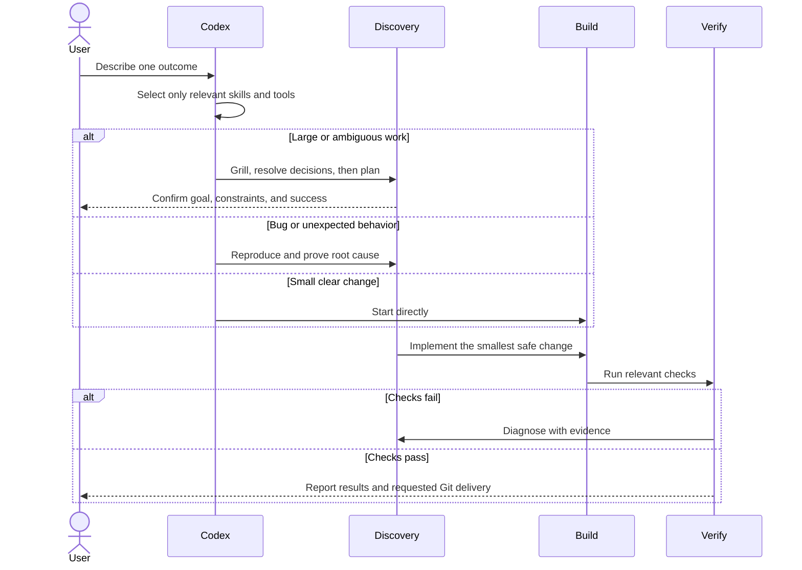

# Codex Powers

A small, portable workflow for building verified software with Codex while keeping session context focused.

It combines:

- **Superpowers** for choosing the right development workflow.
- **Grill** for clarifying large or ambiguous work.
- **Ponytail** for selecting the smallest safe implementation.
- **Fresh verification** before completion or Git delivery.

## Workflow

## Core rules

- **One outcome per task.** Start fresh when the outcome changes or the context becomes noisy.
- **Use the lightest workflow that fits.** Small changes start directly; risky or ambiguous work gets discovery and planning.
- **Resolve the nearest unknown first.** Do not write detailed plans past unsettled decisions.
- **Prefer references over pasted context.** Point Codex to an existing file, example, or URL when possible.
- **Implement minimally.** Reuse project code, the standard library, native features, or installed dependencies before adding code.
- **Verify with evidence.** Run the checks appropriate to the change and report their actual results.
- **Keep Git user-controlled.** Codex commits, pushes, merges, or opens a PR only when explicitly requested.
- **Name branches by intent.** Use `<type>/<short-description>` with `fix`, `feat`, `ui`, `docs`, `refactor`, `test`, or `chore` based on the requested work.

## Request routing

- **New project or large ambiguous feature:** Grill → approved design → plan when needed → implementation.
- **Bug or failing test:** reproduce → root cause → smallest fix → regression check.
- **UI build or redesign:** approved design → `frontend-design` → visual and accessibility checks.
- **UI or accessibility review:** `web-design-guidelines`.
- **Small clear change:** direct implementation using the Ponytail decision ladder.
- **Completion or integration:** fresh verification → user-approved Git action.

## Local-only agent artifacts

Plans, Superpowers specs, handoffs, and private context belong under `.codex/` and stay out of the product repository.

- Add `/.codex/` to `.git/info/exclude` for each project.
- Never stage, commit, or push agent-only documents.
- A handoff should contain the objective, settled decisions, Git state, changed files, verification evidence, blockers, and exact next action.
- Start a fresh task from the concise handoff instead of copying the full conversation.

This repository also ignores the historical `docs/plans/` and `docs/superpowers/` locations.

## Quick start

1. Copy the compact rules from [`AGENTS.md`](AGENTS.md) into the project.
2. Put reusable global rules in `~/.codex/AGENTS.md`; keep project rules project-specific.
3. Install Superpowers and the Grill skills you use.
4. Keep specialist plugins disabled until a task needs them.
5. Open the project in Codex and describe one concrete outcome.

Useful Grill skills from [`mattpocock/skills`](https://github.com/mattpocock/skills):

- `skills/productivity/grill-me`
- `skills/productivity/grilling`
- `skills/engineering/grill-with-docs`
- `skills/engineering/domain-modeling`

## Example requests

- **Large feature:** “Use grill-with-docs to clarify this feature. Confirm our shared understanding before designing or planning it.”
- **Conversation-only idea:** “Use grill-me to stress-test this idea without creating project files.”
- **Bug:** “Reproduce this issue, prove the root cause, then implement and verify the smallest fix.”
- **Small change:** “Implement this directly. Reuse existing code and run the smallest relevant verification.”

More copy-ready prompts are in [`docs/WORKFLOW.md`](docs/WORKFLOW.md).

## Influences

- [Theo Browne's AI coding workflow](https://www.youtube.com/watch?v=xJaMTo2YgO8): focused tasks, concrete references, and active steering.
- [Matt Pocock's writing-for-agents guidance](https://github.com/mattpocock/skills/blob/main/docs/productivity/writing-for-agents.md): progressive disclosure and one source of truth.
- [OpenAI model guidance](https://developers.openai.com/api/docs/guides/latest-model): lean prompts and relevant tools.

## License

[MIT](LICENSE)
